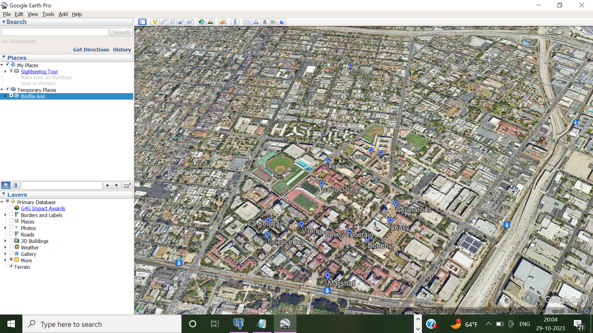
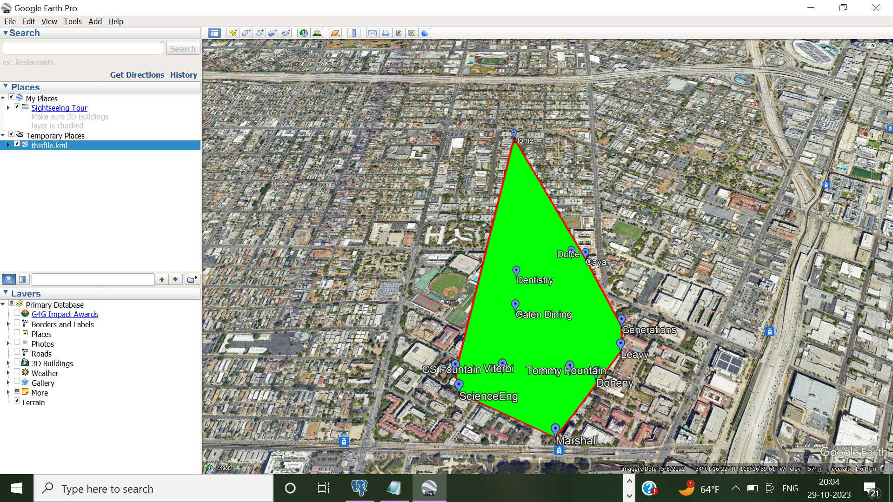
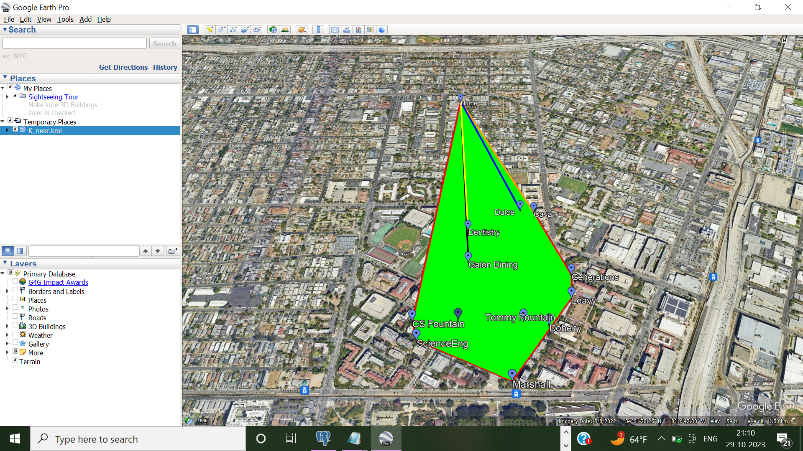
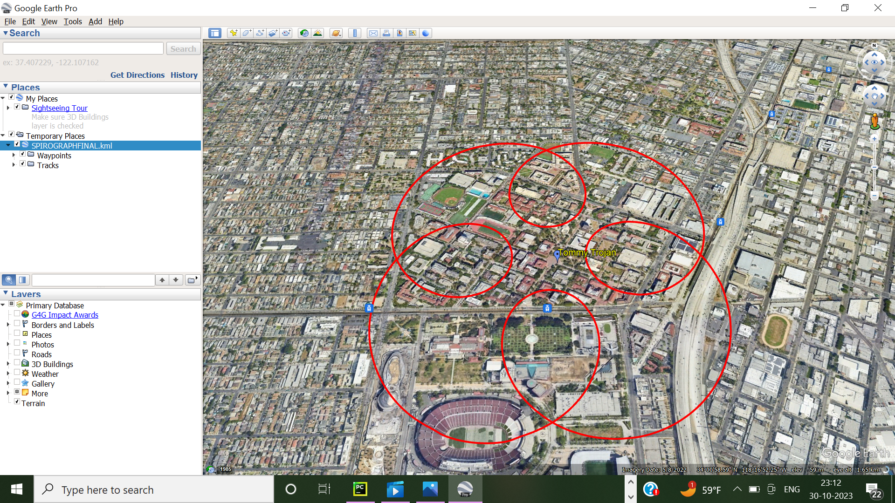
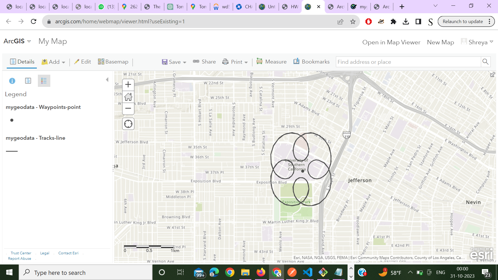

# USC-GeoVoyager-The-Spatial-Saga

## Project Synopsis

This endeavor focuses on the exploration, management, and analysis of geo-spatial information, concentrating on 13 significant locations within the USC campus, including my dormitory. The project encompasses a variety of tasks from crafting a KML file, performing spatial queries via Postgres+PostGIS, to visualizations with Google Earth and OpenLayers, culminating in the generation of a Spirograph curve around the iconic Tommy Trojan.

## Project Phases

### 1. Creation of Spatial Data and KML File

- **Spatial Locations Table:**
   
  Identified locations include three libraries, eateries, water fountains, and academic buildings, meticulously recorded to facilitate our spatial analysis.
  | Location Name                   |  Longitude  |  Latitude |
  |---------------------------------|-------------|-----------|
  | Leavey Library                  | -118.2834358| 34.0213809|
  | Doheny Library                  | -118.2843366| 34.0203954|
  | Science and Eng Library         | -118.2888894| 34.0198992|
  | Viterbi                         | -118.2875113| 34.0206074|
  | Marshall                        | -118.2856719| 34.0186260|
  | Dentistry                       | -118.2873030| 34.0242580|
  | Cava                            | -118.2845707| 34.0251192|
  | Dulce                           | -118.2872337| 34.0228039|
  | Galen Dining                    | -118.2851314| 34.0252201|
  | Tommy Fountain    	            | -118.2852153| 34.0205785|
  | Generations Fountain            | -118.2833323| 34.0222885|
  | CS Fountain 		    | -118.2891122| 34.0205550|   
  | Home                            | xxx         | xxx       |

- **KML File:**
  A .kml file has been crafted to feature the 13 notable locations through placemarks, each annotated with labels and coordinates for further visual exploration.

### 2. Visualization via Google Earth

- **Google Earth Imagery:**
  Importing the KML file into Google Earth to visually map the locations across the USC campus.

  

### 3. Spatial Analysis with Postgres+PostGIS

- **Computing Convex Hull:**
  A spatial query has been conducted to outline the convex hull surrounding the 13 identified points, creating a minimum bounding polygon, visualized and updated in the KML file.

  

- **Identifying Nearest Neighbors:**
  The project further explores the spatial vicinity of my dorm room to its four closest neighbors through the spatial database capabilities, visualized via line segments in the updated KML file.

  

### 4. OpenLayers for Web Visualization

- **Web-based Visualization:**
  Utilizing OpenLayers for an interactive map visualization on a webpage, enabling the persistence of location data through HTML5 localStorage.

### 5. Creating a Spirograph™ Curve around Tommy Trojan

- **Spirograph™ Curve:**
  Created a set of spatial coordinates along a Spirograph™ curve around Tommy Trojan using parametric equations. Generated a new KML file and converted it into an ESRI shapefile for visualization on ArcGIS Online.
 
 
 

## Navigating Geo-Spatial Data Analysis

Through a sequential approach from data collection to intricate spatial visualizations and analyses, this project serves as an illustrative guide for those intrigued by the potentials of geo-spatial data. It illustrates the utilization of various tools and techniques for effective spatial data manipulation, inviting further exploration and development in the vast field of spatial analysis.

Dive into the realm of geo-spatial data with this project and discover the endless possibilities of spatial exploration and analysis!
